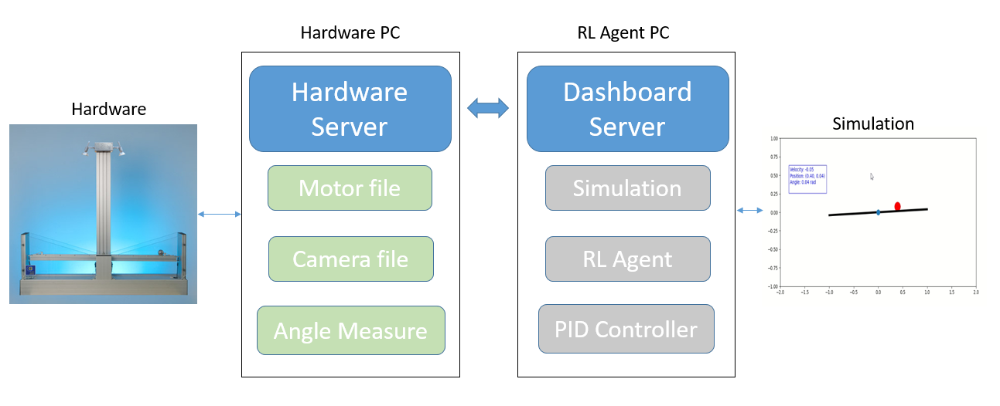
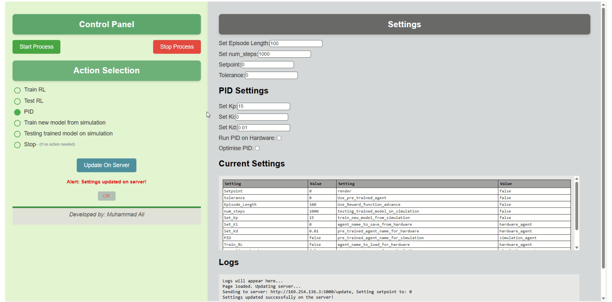
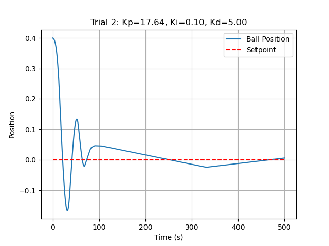
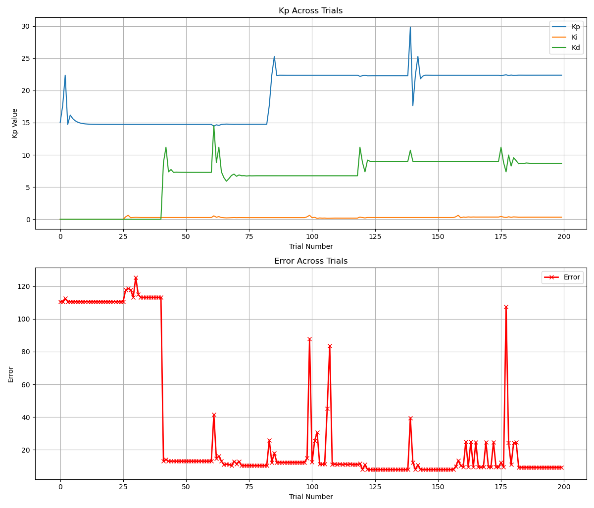

# Ball Beam Control System Using Reinforcement Learning and PID

This project demonstrates how to use **Reinforcement Learning (RL)** to control a **ball-beam system**. The goal is to balance a ball on a beam by adjusting the beam's angle using a trained RL agent. The project uses algorithms like **Proximal Policy Optimization (PPO)** or **Deep Q-Network (DQN)** to enable the RL agent to learn and improve through interaction with the environment. And compare with PID control.

Implementation is based on simulation as well as on hardware.

    

## Dashboard Overview

    

The **Dashboard** is the user interface that allows you to monitor and control the ball-beam system in real time. The dashboard offers the following functionalities:

- **Select Options**: Choose between testing and training the RL agent or using a **PID controller** to manage the system.
- **Start and Stop Process**: Initiate or halt the control process after configuring the necessary parameters.
- **Settings**: Customize settings to fine-tune the system's behavior, including PID parameters or RL training parameters.
- **Logs**: View real-time logs to track the system's status, errors, and performance during operation.

## PID Results

    
    

### Reinforcement Learning Model
The RL agent interacts with the environment to learn how to balance the ball on the beam by maximizing a reward function.

#### Training Steps
1. **Creating the RL Environment**: The environment is defined using the gym library or a custom-built environment. It includes the ball’s position, velocity, and the beam's angle as state variables.
2. **Model Creation**: The RL agent is created using libraries like `stable_baselines3` to implement algorithms like PPO or DQN.
3. **Training the Agent**: The agent starts by taking random actions, receives rewards, and gradually learns to balance the ball over multiple episodes.
4. **Testing the Agent**: After training, the agent is tested to evaluate its performance and the learned behavior.

### The code for the Hardware PC and Main PC is available in the following repositories:
    👉 Flask for Seesaw Control System: https://github.com/MuhammadAliacc/Flask-For-Seesaw-Control-System
    👉 RL Agent to Control Ball Position on Seesaw: [RL-Agent to Control Ball Position on Seesaw](https://github.com/MuhammadAliacc/RL-Agent-To-Control-BallPosition-On-Seesaw)
